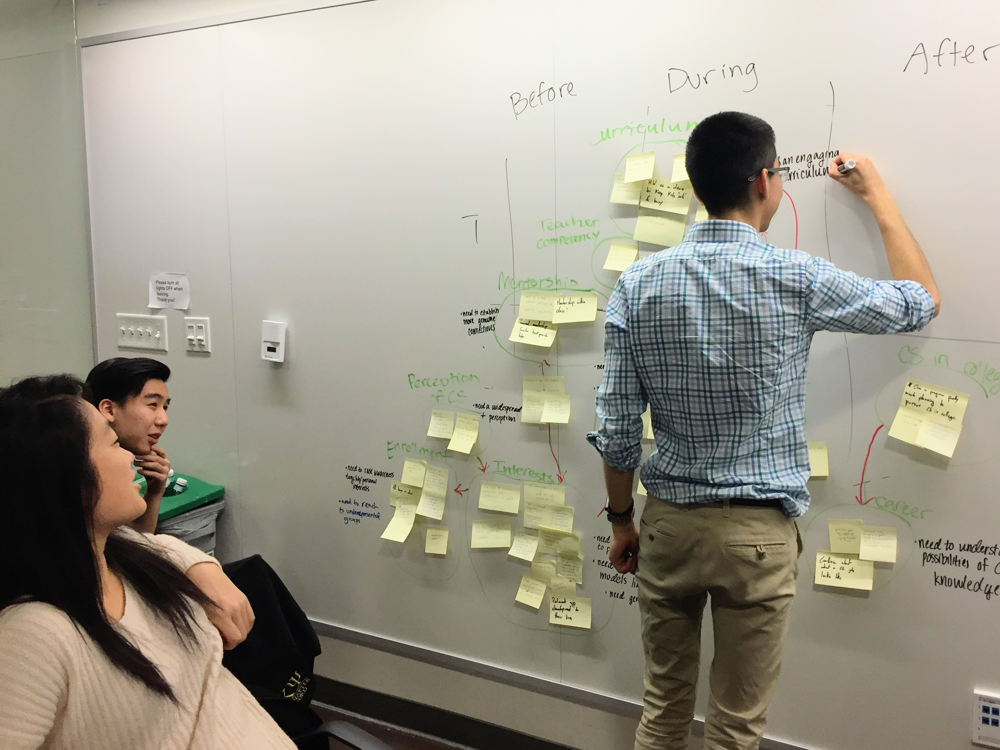
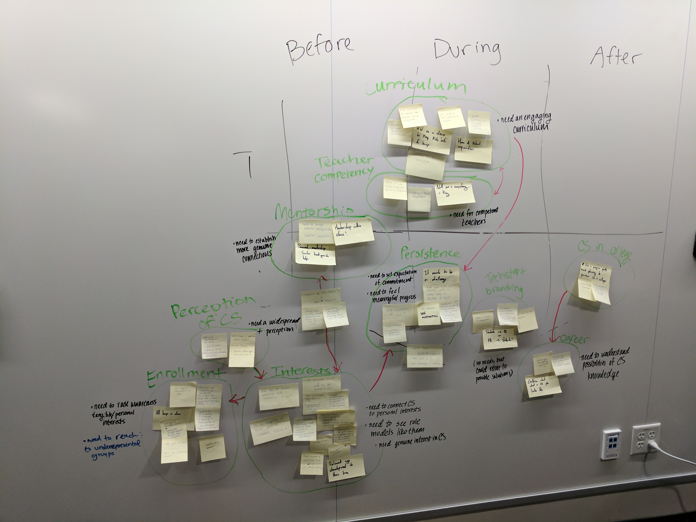

<h1> Spark </h1>

<h2>Needfinding Activity</h2>
<h3>Preparation</h3>
Before any interviews, we compiled a [needfinding brainstorm document](https://docs.google.com/document/d/1mj2fpM7I16-1uJ0Er_FN78Y5MPBIf1A6aOEU844sZ30/edit?usp=sharing), where we outlined questions that we would ask students and teachers at high schools that are part of the Techstart program. The document also included some general ideas that we wanted to explore, as well as a list of additional contacts in the Computer Science education space that we could reach out to. 
<h3>Interviews</h3>
We visited Sequoia High in order to talk to Techstart students and Cameron Dodge, the teacher in charge of Sequoia's Techstart program. At Sequoia, we interviewed 12 different students in total, taking detailed notes about each interview. We also did a video chat interview with Derrick McMillen, a CS teacher at Coliseum College Prep High School in Oakland, which also has a Techstart program.
* [Sequoia Interview Notes](https://drive.google.com/open?id=0B7-rumIIJLRJbTl2M3N0bXZIVE0)
* [Coliseum Interview Notes](https://drive.google.com/open?id=0B45cqVzuDnYdZ3FBd0ZFSE1qOGM)

<h3>Clustering Observations to Identify Needs</h3>
We clustered what we observed, heard, and noted during our interviews into groups in order to help us define needs for the Techstart program. You can view the needs we identified [here](https://docs.google.com/document/d/1z1G-00bip9J17MmZzUHcNbuk2TNSwjPa1JTgBmCbjXE/edit). 

You can view images of our observations clustered into groups [here](https://drive.google.com/open?id=0B45cqVzuDnYdWUtsczJ3M1lTM2s). 

&nbsp;&nbsp;&nbsp;&nbsp;&nbsp;

<h3>Coming Up</h3>
We're also planning needfinding interviews with the following contacts:
* Aga, Facebook Program Manager for Techstart
* StreetCode Academy leadership team
* CS + Social Good student organizers
* Students who participated in Facebook VR camp
* VR camp organizer
* Hidden Genius Project organizers
 
