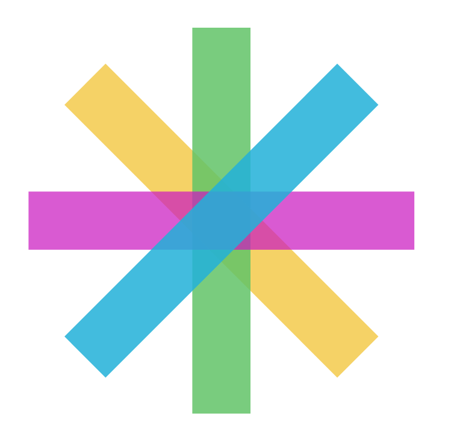
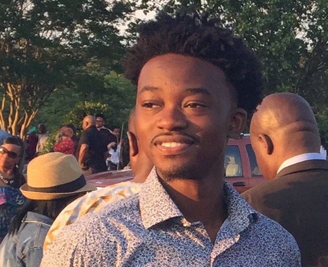
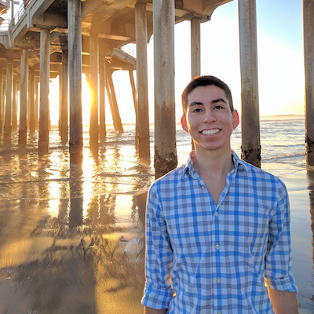
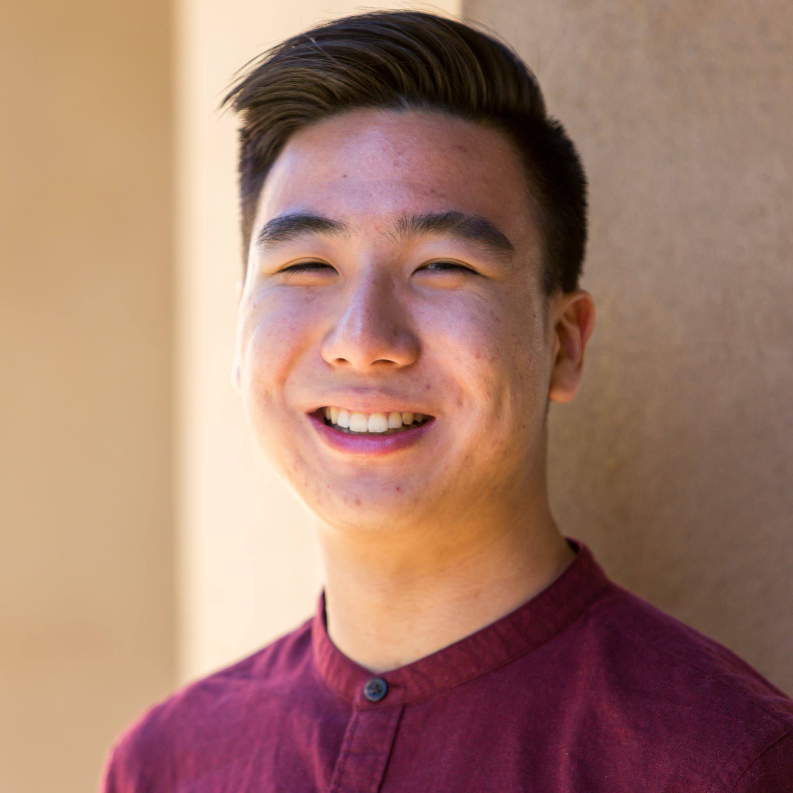
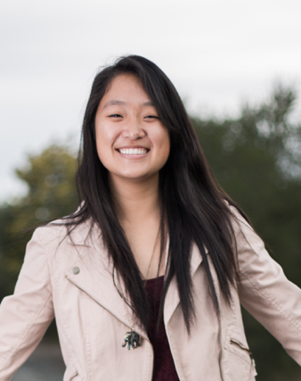
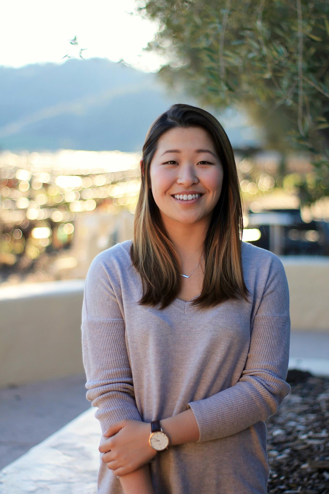

<h1> Spark </h1>
 
<h2> Project Synopsis </h2>
We believe that a quality education is critical in improving students’ lives. **We want to leverage computer science to spark the imagination, instill self-belief and unlock future opportunities for students.** Techstart has already begun working to address the issues faced by many students by providing VR Classroom Kits, curriculum support, and peer role model connections. We hope to further leverage Facebook technologies to create a scalable product that will help bring computer science education to millions of students and to give them skills that will help carry them through their entire lives.
<h2> Members </h2>

&nbsp;&nbsp;&nbsp;&nbsp;&nbsp;&nbsp;&nbsp;&nbsp;&nbsp;&nbsp;&nbsp;&nbsp;

Charles Akin-David &nbsp;&nbsp;&nbsp;&nbsp;&nbsp;&nbsp; Jorge Cueto &nbsp;&nbsp;&nbsp;&nbsp;&nbsp;&nbsp; Alexander Wang   

&nbsp;&nbsp;&nbsp;&nbsp;&nbsp;&nbsp;

 
Serena Wong   
 
Jessica Zhang
 

<table><thead>
<tr>
<th>Member</th>
<th>Skills</th>
<th>Personal Traits</th>
<th>Desired Growth</th>
<th>Weaknesses</th>
<th>Hat Color</th>
</tr>
</thead><tbody>
<tr>
<td>Charles Akin-David</td>
<td>Data Engineering, Machine Learning, Programming</td>
<td>Social, Presenter, Open-minded, Back-Loader</td>
<td>Project Management, Prototyping</td>
<td>Timing</td>
<td>Blue</td>
</tr>
<tr>
<td>Jorge Cueto</td>
<td>Product Management, UI/UX, HCI, Networking</td>
<td>Hardworking, Compassionate, Creative </td>
<td>Prototyping, Programming, Time Management</td>
<td>Context Switching, Data Engineering, AI, NLP</td>
<td>Green</td>
</tr>
<tr>
<td>Alexander Wang</td>
<td>Theory, HCI, AI, Design, Management</td>
<td>Listener</td>
<td>Hacking</td>
<td>Indecisive</td>
<td>Blue</td>
</tr>
<tr>
<td>Serena Wong</td>
<td>HCI, project management, user testing</td>
<td>Agreeable, focused</td>
<td>Creativity, programming</td>
<td>Voicing opinion</td>
<td>Blue</td>
</tr>
<tr>
<td>Jessica Zhang</td>
<td>HCI, Interface Design, Programming</td>
<td>Agreeable, Hardworking</td>
<td>Project Management, Creativity</td>
<td>Often ambivalent, long transition time between tasks</td>
<td>White</td>
</tr>
</tbody></table>

<h2> Link for Communication </h2>
We have chosen to use a <a href="https://fbtechstart.slack.com/" target="_blank">Slack Channel</a> to communicate with each other.  
To get in touch with our group, please email <a href="fbtechstart@googlegroups.com" target="_blank">fbtechstart@googlegroups.com</a>.

<h2> Benchmarking Activity </h2>

<h2> Needfinding Activity </h2>
Before any interviews, we compiled a [needfinding brainstorm sheet](https://docs.google.com/document/d/1mj2fpM7I16-1uJ0Er_FN78Y5MPBIf1A6aOEU844sZ30/edit?usp=sharing)

We visited Sequoia High in order to talk to students of the Techstart program, and to Cameron Dodge, the teacher in charge. We also did a video chat interview with Derrick McMillen, a CS teacher at Coliseum College Prep HS in Oakland, which also has a Techstart program.
[Notes](https://drive.google.com/drive/folders/0B7-rumIIJLRJaFg1ck1HTVppc0E?usp=sharing)

<h2> Brainstorming </h2>
After collecting and debriefing our notes from our needfinding, we performed a brainstorming session. We made observations from our interviews, collected them into categories, drew links between categories, then derived needs from these clusters. [Images](https://drive.google.com/drive/folders/0B45cqVzuDnYdSlBPbmlXYlVMN1U?usp=sharing)
